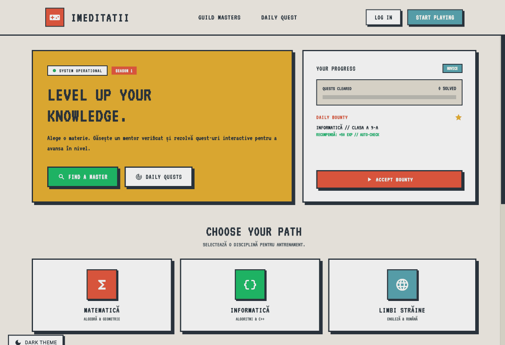

# iMeditatii

> **Live Deployment:** [https://ahmad1827.github.io/](https://ahmad1827.github.io/)

A gamified, retro-terminal styled tutoring platform designed to level up the learning experience. Students can find verified "Guild Masters" (teachers), track their "Player Stats" (progress), and complete "Daily Quests" (exercises) to gain EXP.

---

## Quick Preview

<p align="center">
  
</p>

---

## Features

* **Retro UI/UX**: Terminal-inspired aesthetic with Bento-box layouts and high-contrast color palettes.
* **Role-Based Access**: Dedicated dashboards and profiles for Players (Students) and Guild Masters (Teachers).
* **Guild Roster**: Browse verified teachers by discipline (Mathematics, Computer Science, Languages, etc.).
* **Secure Comms**: Real-time messaging, shared interactive whiteboard, and video calls powered by Firebase and Agora.
* **Training Arena**: Automated test suites evaluate your logic and C++ code in real-time via Judge0.
* **Financial Core**: Integrated Stripe onboarding for teachers to receive direct payments.
* **Quest Progression**: Track completed exercises, XP accumulation, and guild tier rankings.

---

## Tech Stack

* **Frontend**: Flutter (Mobile & Web Support)
* **Backend / Database**: Firebase Firestore & Firebase Auth
* **Storage**: Firebase Cloud Storage
* **Real-time Communication**: Agora RTC Engine
* **Code Execution**: Judge0 API
* **Payments**: Stripe
* **Routing**: `go_router` for deep-linking and web navigation

---

## Getting Started

1. Clone the repository:
   ```bash
   git clone [https://github.com/Ahmad1827/iMeditatii.git](https://github.com/Ahmad1827/iMeditatii.git)
   ```

2. Navigate to the project directory:
   ```bash
   cd iMeditatii
   ```

3. Install dependencies:
   ```bash
   flutter pub get
   ```

4. Set up Firebase (requires FlutterFire CLI):
   ```bash
   flutterfire configure
   ```

5. Set up Environment Variables:
   Create a `.env` file in the root directory (do NOT commit this file):
   ```env
   AGORA_APP_ID=your_agora_app_id_here
   ```

6. Run the app:
   ```bash
   flutter run -d chrome
   ```

---

## How to Contribute (Join the Guild)

Contributions, bug fixes, and feature suggestions are highly encouraged! If you want to help improve the system or add new quests, here is how you can join the party:

1. **Fork** the repository.
2. **Create a new branch** for your feature (`git checkout -b feature/NewAwesomeQuest`).
3. **Commit** your changes (`git commit -m 'Added a new awesome quest'`).
4. **Push** to the branch (`git push origin feature/NewAwesomeQuest`).
5. **Open a Pull Request** and let me review your code!

---

## Copyright & Usage

While I absolutely welcome contributions and encourage you to look at the code to learn, **this codebase is NOT open-source for commercial reuse, redistribution, or white-labeling.**

* ✅ **DO**: Fork the repo to submit Pull Requests to this main repository.
* ✅ **DO**: Read the code to learn how things are built.
* ❌ **DO NOT**: Clone this app, slap your own logo on it, and try to sell it, host it, or publish it as your own.
* ❌ **DO NOT**: Rip the proprietary UI/UX assets or retro branding for your own commercial projects.

**All Rights Reserved.** If you are interested in using parts of this architecture for a commercial project, please reach out to me directly to discuss licensing.